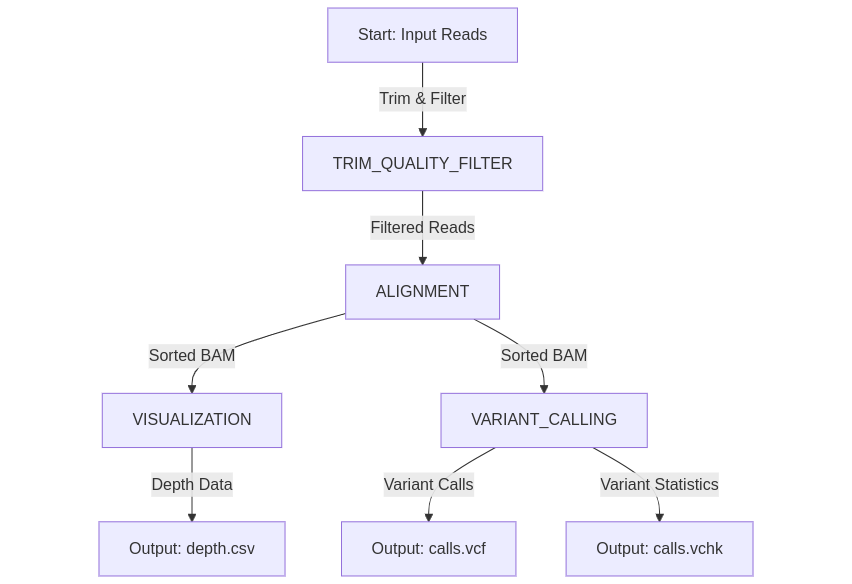

# Nextflow Pipeline Documentation

## Table of Contents
1. [Quick Start](#quick-start)
2. [Pipeline Output](#pipeline-output)
3. [Pipeline Details](#pipeline-details)
    - [Setup Nextflow](#setup-nextflow)
    - [Profiles](#profiles)
    - [Configuration Files](#configuration-files)
    - [SLURM Configuration](#slurm-configuration)

## Quick Start

This section provides a **quick setup** guide for running the pipeline on **HPC** with test data.

#### **1. Set Up Working Directory**
Navigate to your scratch space and create a folder for the pipeline:
```sh
cd $LSFM_CLUSTER_SCRATCH_USER_PATH
mkdir bio4beginners_nextflow
cd bio4beginners_nextflow
```
#### **2. Load Required Modules**
Load the necessary HPC modules:
```sh
module load USS/2022 gcc/9.4.0-pe5.34 miniconda3/4.12.0
```
If you are using conda for the first time, you need to initialize it:
```sh
conda init bash
```
After running this command, **close and reopen your terminal**. After that you will need to start from step 1.

#### **3. Create Conda Environment**
First, set up Bioconda according to the Bioconda documentation, notably setting up channels:
```sh
conda config --add channels bioconda
conda config --add channels conda-forge
```

Now, create and activate the conda environment:
```sh
conda create --name env_nf nextflow
conda activate env_nf
```

#### **4. Copy Source Code**
Copy the pipeline source folder and prepare the output directory:
```sh
cp -r /cfs/earth/scratch/shared/bioinfo4beginners/Genomics/bio4beginners_nextflow/source .
cd source
mkdir results
```

#### **5. Run the Pipeline**
Execute the Nextflow pipeline using test data:
```sh
nextflow run main.nf -profile conda -c slurm.config \
    --input $(realpath input/reads.fastq)  \
    --reference $(realpath input/chrM.fa) \
    --outdir $(realpath results)
```
This command:
- Uses the **conda profile** to manage dependencies.
- Runs with **SLURM** using `slurm.config`.
- Converts all file paths to **absolute paths** to avoid path issues.

After execution, results will be stored in the `results/` directory.

## Pipeline Output
The pipeline generates:
- `calls.vcf` - Contains identified variants
- `calls.vchk` - Variant statistics

Intermediate files are **not saved**. To keep specific outputs, modify processes using:

```nextflow
publishDir params.outdir // Saves process outputs to outdir
```

Modify this in `main.nf` for the processes where you want to retain intermediate files.


## Pipeline Details



### Setup Nextflow
To run this pipeline, first install and activate Nextflow using conda:
```sh
conda config --add channels bioconda
conda config --add channels conda-forge
```
```sh
conda create --name env_nf nextflow
conda activate env_nf
```

### Profiles
Profiles describe the environment Nextflow will use to run processes, specified by the `-profile <conda>`. In this pipeline, only the `conda` profile is supported.

The conda environment is described with key word `conda` in each process in `main.nf`. It could be set in two ways:
1. Using an existing conda environment. For example right now it set as:
   ```
   /cfs/earth/scratch/shared/bioinfo4beginners/Genomics/Env_Genomics
   ```
2. Using a `.yml` file to create a new environment or specifying a different conda path.

To modify the environment, update the conda path in `main.nf`.

### Configuration Files
Each Nextflow pipeline has a default configuration file called `nextflow.config`. If additional configuration files are needed (e.g., for running the pipeline on an HPC system), they can be included using the `-c` parameter when executing Nextflow.

For example:

```sh
nextflow run main.nf -profile conda -c slurm.config
```

This allows different configurations to be applied without modifying the default `nextflow.config` file.

### SLURM Configuration
The `slurm.config` file is used to run Nextflow with SLURM. It:
- Submits each process as a SLURM job
- Defines resource limits (CPU, memory, partition, etc.)
- Allows customization per process

Typically, to run a script on an HPC system with SLURM, we use `sbatch`. However, Nextflow supports SLURM as an executor and can submit jobs automatically. To enable this, set `process.executor` to `slurm` in the configuration file.

For Earth HPC, it is also required to specify the partition and resource limits. These details can be configured in `slurm.config`. It is also possible to set specific resource requirements for individual processes within this file.


